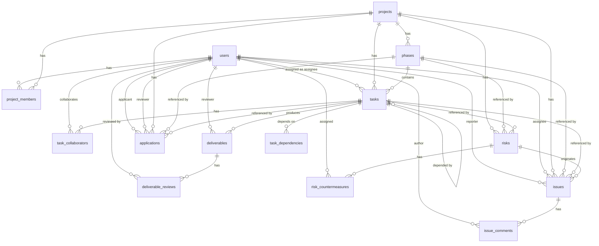

# PDM 基本設計書 初版

- 作成日: 2026-06-21
- ステータス: 初版（Draft）
- 対象システム: PDM (Project Development Manager)

---

## 1. システム概要

PDM (Project Development Manager) は、JP1のJob Managementに着想を得たプロジェクト開発工程・タスク・スケジュール統合管理システムである。ソフトウェア開発プロジェクトを対象に、フェーズ単位の工程管理、3階層タスク管理、依存関係・クリティカルパス管理、リスク・課題・成果物管理の機能を提供する。

### 主要概念

| 概念 | 説明 |
|------|------|
| **Project（プロジェクト）** | 管理の最上位単位。JP1のJobnet相当。複数のPhaseで構成される。 |
| **Phase（フェーズ）** | 工程を分割した管理単位（例：要件定義 / 設計 / 開発 / テスト / リリース）。直列/並列実行を設定可能。ゲート管理によりPhase間の進行を制御する。 |
| **Task（タスク）** | 3階層構造（ルート / 子 / 孫）。末端タスク（リーフ）を作業単位とする。JP1のJob相当。 |
| **Dependency（依存関係）** | タスク間の先行/後続関係。FS/SS/FF/SFの4種。JP1の優先順位条件相当。 |
| **Risk（リスク）** | プロジェクトに影響を与える不確実性。影響度×確率で優先度を自動算出。ヒートマップ表示。 |
| **Issue（課題）** | 顕在化した問題。バグ、仕様変更、要望などを管理。リスクから自動変換可能。 |
| **Deliverable（成果物）** | タスクのアウトプット。ドキュメント、ソースコード、テスト結果など。レビューフローを持つ。 |
| **Gate（ゲート）** | フェーズ完了条件。全タスク完了後、PM承認を経て次フェーズへ進行可能。 |
| **Application（申請）** | 保留・中断・ゲート通過の各申請。理由・エビデンスを添付しPMが承認/却下する。 |

---

## 2. システム構成図

### アーキテクチャ概要

```
┌─────────────────────────────────────────────────────────────┐
│                    Frontend (React + TypeScript)             │
│  ┌─────────┐ ┌──────────┐ ┌──────────┐ ┌───────────────┐   │
│  │ 認証画面 │ │ ダッシュ  │ │ タスク   │ │ ガントチャート │   │
│  │         │ │ ボード   │ │ 管理画面 │ │ (dhtmlx-gantt) │   │
│  └─────────┘ └──────────┘ └──────────┘ └───────────────┘   │
│        │            │            │              │           │
│        └────────────┴────────────┴──────────────┘           │
│                         │ HTTP/REST                         │
│                   (axios / fetch)                           │
└─────────────────────────┬───────────────────────────────────┘
                          │
┌─────────────────────────▼───────────────────────────────────┐
│                   Backend (FastAPI / Python)                 │
│  ┌──────────┐ ┌──────────┐ ┌──────────┐ ┌──────────────┐   │
│  │ Auth     │ │ API      │ │ Service  │ │ Domain       │   │
│  │ Module   │ │ Routers  │ │ Layer    │ │ Logic        │   │
│  │(JWT/SSO) │ │          │ │          │ │(StateMachine) │   │
│  └──────────┘ └──────────┘ └──────────┘ └──────────────┘   │
│                                        │                    │
│  ┌──────────────────────────────────────┴──────────────────┐ │
│  │              Infrastructure Layer                       │ │
│  │  ┌──────────┐ ┌──────────┐ ┌──────────┐ ┌──────────┐  │ │
│  │  │SQLAlchemy│ │ Redis    │ │ File     │ │ Celery   │  │ │
│  │  │ (ORM)    │ │ (Cache)  │ │ Storage  │ │ (Async)  │  │ │
│  │  └──────────┘ └──────────┘ └──────────┘ └──────────┘  │ │
│  └──────────────────────────────────────────────────────────┘ │
└─────────────────────────┬───────────────────────────────────┘
                          │
┌─────────────────────────▼───────────────────────────────────┐
│                    Database (PostgreSQL)                     │
│  ┌──────────┐ ┌──────────┐ ┌──────────┐ ┌──────────────┐   │
│  │ ユーザー  │ │ プロジェクト│ │ タスク   │ │ 依存関係     │   │
│  │ テーブル  │ │ テーブル  │ │ テーブル │ │ テーブル     │   │
│  └──────────┘ └──────────┘ └──────────┘ └──────────────┘   │
└─────────────────────────────────────────────────────────────┘
```

### レイヤー図

```
┌──────────────────────────────────────┐
│          Presentation Layer          │
│   React SPA / REST API Endpoints     │
├──────────────────────────────────────┤
│        Application Layer             │
│    Use Cases / Service / DTO         │
├──────────────────────────────────────┤
│          Domain Layer                │
│   Entities / State Machine / Rules   │
│   (Progress Calculation, Critical    │
│    Path, Dependency Validation)      │
├──────────────────────────────────────┤
│       Infrastructure Layer           │
│   DB / ORM / Cache / File Storage    │
│   / External Integration             │
└──────────────────────────────────────┘
```

---

## 3. 画面遷移図

```
┌──────────────┐
│  ログイン画面  │
└──────┬───────┘
       │ ログイン成功
       ▼
┌──────────────────┐
│ プロジェクト一覧  │◄──────────────────────┐
│   画面           │                        │
└──────┬───────────┘                        │
       │ プロジェクト選択                     │
       ▼                                    │
┌──────────────────┐                        │
│ プロジェクト詳細  │──→ ユーザー管理画面      │
│ （ダッシュボード）  │──→ 申請承認画面         │
└──────┬───────────┘                        │
       │                                    │
       ├────────────────────────────────────┤
       │ フェーズ選択                         │
       ▼                                    │
┌──────────────────┐                        │
│ フェーズ管理画面   │                        │
└──────┬───────────┘                        │
       │                                    │
       ▼                                    │
┌────────────────────────────────────┐      │
│   タスク管理画面（メイン画面）        │      │
│   ┌──────────┐ ┌──────────────┐   │      │
│   │ タスク    │ │ ガント       │   │      │
│   │ ツリー    │ │ チャート     │   │      │
│   └──────────┘ └──────────────┘   │      │
│   ┌──────────────────────────┐   │      │
│   │    タスク詳細パネル       │   │      │
│   └──────────────────────────┘   │      │
└──────┬─────────────────────────┘      │
       │                                │
       ├──→ 依存関係設定画面              │
       ├──→ リスク管理画面               │
       ├──→ 課題管理画面                  │
       └──→ 成果物管理画面               │
       │                                │
       └────────────────────────────────┘
```

### 画面一覧と遷移

| 画面名 | 経路 | 説明 |
|--------|------|------|
| ログイン画面 | `/login` | メールアドレス+パスワード認証またはSSO |
| プロジェクト一覧画面 | `/projects` | ログイン後トップ。参加プロジェクトをカード/一覧表示 |
| プロジェクト詳細画面 | `/projects/:id` | ダッシュボード。進捗サマリ、フェーズ一覧、リスク/課題サマリ |
| フェーズ管理画面 | `/projects/:id/phases` | フェーズの追加/編集/順序変更/ゲート申請 |
| タスク管理画面 | `/projects/:id/phases/:phaseId` | メイン画面。ツリー＋ガントチャート＋詳細パネル |
| 依存関係設定画面 | `/projects/:id/dependencies` | タスク間依存関係の視覚的設定 |
| リスク管理画面 | `/projects/:id/risks` | リスク一覧、ヒートマップ、対応策管理 |
| 課題管理画面 | `/projects/:id/issues` | 課題一覧、カンバン、コメントスレッド |
| 成果物管理画面 | `/projects/:id/deliverables` | 成果物一覧、バージョン管理、レビューステータス |
| ユーザー管理画面 | `/projects/:id/members` | メンバー招待・ロール割当（PM/システム管理者のみ） |
| 申請承認画面 | `/projects/:id/applications` | 承認待ち申請一覧、承認/却下操作 |

---

## 4. テーブル定義（ER図）

### 4.1 テーブル一覧

#### users

| カラム名 | 型 | 制約 | 説明 |
|----------|-----|------|------|
| id | UUID | PK | ユーザーID |
| name | VARCHAR(255) | NOT NULL | ユーザー名 |
| email | VARCHAR(255) | UNIQUE, NOT NULL | メールアドレス（ログインID） |
| password_hash | VARCHAR(255) | NOT NULL | パスワードハッシュ |
| role | VARCHAR(50) | NOT NULL, DEFAULT 'worker' | システムロール: system_admin / pm / sub_leader / worker / viewer |
| created_at | TIMESTAMP | NOT NULL, DEFAULT NOW() | 作成日時 |
| updated_at | TIMESTAMP | NOT NULL, DEFAULT NOW() | 更新日時 |

#### projects

| カラム名 | 型 | 制約 | 説明 |
|----------|-----|------|------|
| id | UUID | PK | プロジェクトID |
| name | VARCHAR(255) | NOT NULL | プロジェクト名 |
| description | TEXT | | 説明 |
| start_date | DATE | NOT NULL | 開始日 |
| end_date | DATE | NOT NULL | 終了日 |
| status | VARCHAR(20) | NOT NULL, DEFAULT 'planning' | 状態: planning / active / closed |
| progress_calc_method | VARCHAR(20) | NOT NULL, DEFAULT 'task_count' | 進捗計算方法: task_count / man_hours |
| created_at | TIMESTAMP | NOT NULL, DEFAULT NOW() | 作成日時 |
| updated_at | TIMESTAMP | NOT NULL, DEFAULT NOW() | 更新日時 |

#### project_members

| カラム名 | 型 | 制約 | 説明 |
|----------|-----|------|------|
| id | UUID | PK | メンバーシップID |
| project_id | UUID | FK → projects.id, NOT NULL | プロジェクトID |
| user_id | UUID | FK → users.id, NOT NULL | ユーザーID |
| role_in_project | VARCHAR(20) | NOT NULL | プロジェクト内ロール: pm / sub_leader / worker / viewer |
| created_at | TIMESTAMP | NOT NULL, DEFAULT NOW() | 作成日時 |
| UNIQUE | (project_id, user_id) | | 同一プロジェクト内で重複不可 |

#### phases

| カラム名 | 型 | 制約 | 説明 |
|----------|-----|------|------|
| id | UUID | PK | フェーズID |
| project_id | UUID | FK → projects.id, NOT NULL | 所属プロジェクト |
| name | VARCHAR(255) | NOT NULL | フェーズ名 |
| description | TEXT | | 説明 |
| sort_order | INTEGER | NOT NULL, DEFAULT 0 | 表示順 |
| parallel_execution | BOOLEAN | NOT NULL, DEFAULT FALSE | 並列実行フラグ（true=前Phase完了不要） |
| status | VARCHAR(20) | NOT NULL, DEFAULT 'pending' | 状態: pending / active / gate_waiting / completed |
| start_date | DATE | | 開始日 |
| end_date | DATE | | 終了日 |
| created_at | TIMESTAMP | NOT NULL, DEFAULT NOW() | 作成日時 |
| updated_at | TIMESTAMP | NOT NULL, DEFAULT NOW() | 更新日時 |

#### tasks

| カラム名 | 型 | 制約 | 説明 |
|----------|-----|------|------|
| id | UUID | PK | タスクID |
| project_id | UUID | FK → projects.id, NOT NULL | 所属プロジェクト |
| phase_id | UUID | FK → phases.id, NOT NULL | 所属フェーズ |
| parent_task_id | UUID | FK → tasks.id, NULL | 親タスクID（自己参照） |
| name | VARCHAR(255) | NOT NULL | タスク名 |
| description | TEXT | | 説明 |
| task_level | VARCHAR(20) | NOT NULL | 階層: root / child / grandchild |
| assignee_id | UUID | FK → users.id, NOT NULL | 担当者ID |
| estimated_hours | DECIMAL(10,2) | NOT NULL, DEFAULT 0 | 見積工数 |
| actual_hours | DECIMAL(10,2) | NULL | 実績工数 |
| status | VARCHAR(20) | NOT NULL, DEFAULT 'not_started' | 状態: not_started / ready / in_progress / awaiting_approval / completed / on_hold / suspended |
| weight | DECIMAL(5,2) | NOT NULL, DEFAULT 1.00 | 進捗計算用重み |
| start_date | DATE | | 開始日 |
| end_date | DATE | | 終了日 |
| sort_order | INTEGER | NOT NULL, DEFAULT 0 | 同一親内の表示順 |
| created_at | TIMESTAMP | NOT NULL, DEFAULT NOW() | 作成日時 |
| updated_at | TIMESTAMP | NOT NULL, DEFAULT NOW() | 更新日時 |

インデックス: (project_id, phase_id, parent_task_id), (assignee_id), (status)

#### task_collaborators

| カラム名 | 型 | 制約 | 説明 |
|----------|-----|------|------|
| id | UUID | PK | 関連ID |
| task_id | UUID | FK → tasks.id, NOT NULL | タスクID |
| user_id | UUID | FK → users.id, NOT NULL | 協力者ユーザーID |
| UNIQUE | (task_id, user_id) | | 重複不可 |

#### task_dependencies

| カラム名 | 型 | 制約 | 説明 |
|----------|-----|------|------|
| id | UUID | PK | 依存関係ID |
| task_id | UUID | FK → tasks.id, NOT NULL | 依存元タスク（このタスクが依存する） |
| depends_on_task_id | UUID | FK → tasks.id, NOT NULL | 依存先タスク（このタスクに依存される） |
| dependency_type | VARCHAR(2) | NOT NULL, DEFAULT 'fs' | 依存タイプ: fs / ss / ff / sf |
| lag_days | INTEGER | NOT NULL, DEFAULT 0 | ラグ日数 |
| UNIQUE | (task_id, depends_on_task_id) | | 同一依存関係の重複不可 |
| CHECK | (task_id <> depends_on_task_id) | | 自己依存禁止 |

#### deliverables

| カラム名 | 型 | 制約 | 説明 |
|----------|-----|------|------|
| id | UUID | PK | 成果物ID |
| task_id | UUID | FK → tasks.id, NOT NULL | 紐づくタスク |
| name | VARCHAR(255) | NOT NULL | 成果物名 |
| description | TEXT | | 説明 |
| type | VARCHAR(50) | NOT NULL | 種別: document / source_code / test_result / report / other |
| file_path | VARCHAR(500) | | ファイルパス |
| file_url | VARCHAR(500) | | ファイルURL |
| version | VARCHAR(50) | NOT NULL, DEFAULT '1.0' | バージョン |
| status | VARCHAR(20) | NOT NULL, DEFAULT 'not_created' | 状態: not_created / in_progress / in_review / completed |
| reviewer_id | UUID | FK → users.id, NULL | レビューアID |
| created_at | TIMESTAMP | NOT NULL, DEFAULT NOW() | 作成日時 |
| updated_at | TIMESTAMP | NOT NULL, DEFAULT NOW() | 更新日時 |

#### deliverable_reviews

| カラム名 | 型 | 制約 | 説明 |
|----------|-----|------|------|
| id | UUID | PK | レビューID |
| deliverable_id | UUID | FK → deliverables.id, NOT NULL | 成果物ID |
| reviewer_id | UUID | FK → users.id, NOT NULL | レビューアID |
| status | VARCHAR(20) | NOT NULL, DEFAULT 'pending' | 状態: pending / approved / rejected |
| comment | TEXT | | レビューコメント |
| reviewed_at | TIMESTAMP | | レビュー日時 |

#### risks

| カラム名 | 型 | 制約 | 説明 |
|----------|-----|------|------|
| id | UUID | PK | リスクID |
| project_id | UUID | FK → projects.id, NOT NULL | 所属プロジェクト |
| phase_id | UUID | FK → phases.id, NULL | 関連フェーズ |
| task_id | UUID | FK → tasks.id, NULL | 関連タスク |
| name | VARCHAR(255) | NOT NULL | リスク名 |
| description | TEXT | | 説明 |
| impact | VARCHAR(10) | NOT NULL | 影響度: high / medium / low |
| probability | VARCHAR(10) | NOT NULL | 発生確率: high / medium / low |
| priority | VARCHAR(10) | NOT NULL | 優先度（自動計算）: critical / high / medium / low |
| status | VARCHAR(20) | NOT NULL, DEFAULT 'unaddressed' | 状態: unaddressed / addressing / monitoring / occurred / closed |
| created_at | TIMESTAMP | NOT NULL, DEFAULT NOW() | 作成日時 |
| updated_at | TIMESTAMP | NOT NULL, DEFAULT NOW() | 更新日時 |

優先度計算ルール: impact × probability の組み合わせ表による自動判定。

#### risk_countermeasures

| カラム名 | 型 | 制約 | 説明 |
|----------|-----|------|------|
| id | UUID | PK | 対策ID |
| risk_id | UUID | FK → risks.id, NOT NULL | リスクID |
| description | TEXT | NOT NULL | 対策内容 |
| assignee_id | UUID | FK → users.id, NOT NULL | 担当者ID |
| due_date | DATE | | 期限日 |
| status | VARCHAR(20) | NOT NULL, DEFAULT 'planned' | 状態: planned / in_progress / completed |

#### issues

| カラム名 | 型 | 制約 | 説明 |
|----------|-----|------|------|
| id | UUID | PK | 課題ID |
| project_id | UUID | FK → projects.id, NOT NULL | 所属プロジェクト |
| phase_id | UUID | FK → phases.id, NULL | 関連フェーズ |
| task_id | UUID | FK → tasks.id, NULL | 関連タスク |
| risk_id | UUID | FK → risks.id, NULL | 派生元リスク |
| name | VARCHAR(255) | NOT NULL | 課題名 |
| description | TEXT | | 説明 |
| type | VARCHAR(30) | NOT NULL | 種別: bug / specification_change / request / obstacle / other |
| priority | VARCHAR(10) | NOT NULL | 優先度: urgent / high / medium / low |
| status | VARCHAR(20) | NOT NULL, DEFAULT 'unaddressed' | 状態: unaddressed / addressing / resolved / rejected / closed |
| reporter_id | UUID | FK → users.id, NOT NULL | 報告者ID |
| assignee_id | UUID | FK → users.id, NULL | 担当者ID |
| due_date | DATE | NULL | 期限日 |
| created_at | TIMESTAMP | NOT NULL, DEFAULT NOW() | 作成日時 |
| updated_at | TIMESTAMP | NOT NULL, DEFAULT NOW() | 更新日時 |

#### issue_comments

| カラム名 | 型 | 制約 | 説明 |
|----------|-----|------|------|
| id | UUID | PK | コメントID |
| issue_id | UUID | FK → issues.id, NOT NULL | 課題ID |
| user_id | UUID | FK → users.id, NOT NULL | 投稿者ID |
| content | TEXT | NOT NULL | コメント内容 |
| created_at | TIMESTAMP | NOT NULL, DEFAULT NOW() | 作成日時 |

#### applications

| カラム名 | 型 | 制約 | 説明 |
|----------|-----|------|------|
| id | UUID | PK | 申請ID |
| project_id | UUID | FK → projects.id, NOT NULL | 所属プロジェクト |
| task_id | UUID | FK → tasks.id, NULL | 関連タスク |
| phase_id | UUID | FK → phases.id, NULL | 関連フェーズ（ゲート通過申請時） |
| application_type | VARCHAR(20) | NOT NULL | 申請種別: hold / suspend / gate_pass |
| reason | TEXT | NOT NULL | 申請理由 |
| evidence | TEXT | NULL | エビデンス（任意） |
| status | VARCHAR(20) | NOT NULL, DEFAULT 'pending' | 状態: pending / approved / rejected |
| applicant_id | UUID | FK → users.id, NOT NULL | 申請者ID |
| reviewer_id | UUID | FK → users.id, NULL | 承認者ID（PM） |
| rejection_reason | TEXT | NULL | 却下理由 |
| created_at | TIMESTAMP | NOT NULL, DEFAULT NOW() | 作成日時 |
| updated_at | TIMESTAMP | NOT NULL, DEFAULT NOW() | 更新日時 |

### 4.2 ER図



---

## 5. API設計

### 5.1 RESTful API一覧

#### 認証系

| Method | Path | 説明 | 認証 |
|--------|------|------|------|
| POST | /api/auth/login | ログイン（JWT発行） | No |
| POST | /api/auth/logout | ログアウト | Yes |
| GET | /api/auth/me | 現在のユーザー情報取得 | Yes |

#### ユーザー管理（システム管理者のみ）

| Method | Path | 説明 | 権限 |
|--------|------|------|------|
| GET | /api/users | ユーザー一覧 | system_admin |
| POST | /api/users | ユーザー作成 | system_admin |
| GET | /api/users/:id | ユーザー詳細 | system_admin |
| PUT | /api/users/:id | ユーザー編集 | system_admin |
| DELETE | /api/users/:id | ユーザー削除 | system_admin |

#### プロジェクト

| Method | Path | 説明 | 権限 |
|--------|------|------|------|
| GET | /api/projects | 参加プロジェクト一覧 | 全認証ユーザー |
| POST | /api/projects | プロジェクト作成 | system_admin, pm |
| GET | /api/projects/:id | プロジェクト詳細 | プロジェクトメンバー |
| PUT | /api/projects/:id | プロジェクト編集 | pm |
| DELETE | /api/projects/:id | プロジェクト削除 | system_admin |
| GET | /api/projects/:id/members | メンバー一覧 | プロジェクトメンバー |
| POST | /api/projects/:id/members | メンバー追加 | pm |
| DELETE | /api/projects/:id/members/:userId | メンバー削除 | pm |

#### フェーズ

| Method | Path | 説明 | 権限 |
|--------|------|------|------|
| GET | /api/projects/:id/phases | フェーズ一覧（順序付き） | プロジェクトメンバー |
| POST | /api/projects/:id/phases | フェーズ作成 | pm |
| PUT | /api/phases/:id | フェーズ編集 | pm |
| DELETE | /api/phases/:id | フェーズ削除 | pm |
| POST | /api/phases/:id/gate-request | ゲート通過申請 | sub_leader, pm |

#### タスク

| Method | Path | 説明 | 権限 |
|--------|------|------|------|
| GET | /api/phases/:id/tasks | タスク一覧（ツリー構造） | プロジェクトメンバー |
| POST | /api/phases/:id/tasks | タスク作成 | pm, sub_leader |
| GET | /api/tasks/:id | タスク詳細 | プロジェクトメンバー |
| PUT | /api/tasks/:id | タスク編集 | pm, sub_leader |
| DELETE | /api/tasks/:id | タスク削除 | pm |
| PUT | /api/tasks/:id/status | 状態変更 | 担当者/sub_leader/pm |
| GET | /api/tasks/:id/dependencies | 依存関係一覧 | プロジェクトメンバー |
| POST | /api/tasks/:id/dependencies | 依存関係作成 | pm, sub_leader |
| DELETE | /api/tasks/:id/dependencies/:depId | 依存関係削除 | pm |

#### 申請

| Method | Path | 説明 | 権限 |
|--------|------|------|------|
| POST | /api/tasks/apply | 申請作成 | 担当者, sub_leader |
| GET | /api/applications | 申請一覧 | プロジェクトメンバー |
| PUT | /api/applications/:id/approve | 承認 | pm |
| PUT | /api/applications/:id/reject | 却下 | pm |

#### 成果物

| Method | Path | 説明 | 権限 |
|--------|------|------|------|
| GET | /api/tasks/:id/deliverables | 成果物一覧 | プロジェクトメンバー |
| POST | /api/tasks/:id/deliverables | 成果物作成 | 担当者, sub_leader |
| PUT | /api/deliverables/:id | 成果物編集 | 担当者, sub_leader |
| DELETE | /api/deliverables/:id | 成果物削除 | pm, sub_leader |
| POST | /api/deliverables/:id/review | レビュー提出 | レビューア |

#### リスク

| Method | Path | 説明 | 権限 |
|--------|------|------|------|
| GET | /api/projects/:id/risks | リスク一覧（ヒートマップデータ含む） | プロジェクトメンバー |
| POST | /api/projects/:id/risks | リスク登録 | pm, sub_leader |
| PUT | /api/risks/:id | リスク編集 | pm, sub_leader |
| DELETE | /api/risks/:id | リスク削除 | pm |

#### 課題

| Method | Path | 説明 | 権限 |
|--------|------|------|------|
| GET | /api/projects/:id/issues | 課題一覧（フィルタ/カンバン） | プロジェクトメンバー |
| POST | /api/projects/:id/issues | 課題登録 | プロジェクトメンバー |
| PUT | /api/issues/:id | 課題編集 | pm, assignee |
| DELETE | /api/issues/:id | 課題削除 | pm |
| GET | /api/issues/:id/comments | コメント一覧 | プロジェクトメンバー |
| POST | /api/issues/:id/comments | コメント投稿 | プロジェクトメンバー |

#### ダッシュボード・レポート

| Method | Path | 説明 | 権限 |
|--------|------|------|------|
| GET | /api/projects/:id/dashboard | ダッシュボードデータ（集計値） | プロジェクトメンバー |
| GET | /api/projects/:id/report | レポート出力（PDF/CSV） | プロジェクトメンバー |

### 5.2 主要APIのRequest/Response例

#### POST /api/projects（プロジェクト作成）

```json
// Request
{
  "name": "新規システム開発",
  "description": "顧客管理システムの新規開発",
  "start_date": "2026-07-01",
  "end_date": "2026-12-31",
  "progress_calc_method": "task_count"
}

// Response (201 Created)
{
  "id": "a1b2c3d4-...",
  "name": "新規システム開発",
  "description": "顧客管理システムの新規開発",
  "start_date": "2026-07-01",
  "end_date": "2026-12-31",
  "status": "planning",
  "progress_calc_method": "task_count",
  "created_at": "2026-06-21T10:00:00Z",
  "updated_at": "2026-06-21T10:00:00Z"
}
```

#### POST /api/phases/:id/tasks（タスク作成 - 3階層）

```json
// Request（ルートタスク作成 - parent_task_id 省略）
{
  "name": "要件定義書作成",
  "description": "顧客ヒアリングに基づく要件定義書の作成",
  "assignee_id": "u1-...",
  "estimated_hours": 40.0,
  "weight": 1.0,
  "start_date": "2026-07-01",
  "end_date": "2026-07-15",
  "sort_order": 1
}

// Response
{
  "id": "t1-...",
  "project_id": "p1-...",
  "phase_id": "ph1-...",
  "parent_task_id": null,
  "name": "要件定義書作成",
  "task_level": "root",
  "assignee_id": "u1-...",
  "estimated_hours": 40.0,
  "actual_hours": null,
  "status": "not_started",
  "weight": 1.0,
  "start_date": "2026-07-01",
  "end_date": "2026-07-15",
  "sort_order": 1,
  "created_at": "2026-06-21T10:00:00Z"
}

// Request（子タスク作成 - parent_task_id 指定）
{
  "name": "現行システム調査",
  "description": "現行システムの機能一覧・構成調査",
  "parent_task_id": "t1-...",
  "assignee_id": "u2-...",
  "estimated_hours": 16.0,
  "weight": 1.0,
  "start_date": "2026-07-01",
  "end_date": "2026-07-08",
  "sort_order": 1
}

// Response（子タスク）
{
  "id": "t2-...",
  "project_id": "p1-...",
  "phase_id": "ph1-...",
  "parent_task_id": "t1-...",
  "name": "現行システム調査",
  "task_level": "child",
  "assignee_id": "u2-...",
  "estimated_hours": 16.0,
  "actual_hours": null,
  "status": "not_started",
  "weight": 1.0,
  "start_date": "2026-07-01",
  "end_date": "2026-07-08",
  "sort_order": 1,
  "created_at": "2026-06-21T10:00:00Z"
}
```

#### PUT /api/tasks/:id/status（状態変更）

```json
// Request（対応中→承認待ち）
{
  "status": "awaiting_approval"
}

// Response (200 OK)
{
  "id": "t1-...",
  "name": "要件定義書作成",
  "status": "awaiting_approval",
  "actual_hours": 38.5,
  "previous_status": "in_progress",
  "transition_allowed": true,
  "message": "状態を「対応中」から「承認待ち」に変更しました"
}

// Error Response (422 - 不正な遷移)
{
  "error": "invalid_transition",
  "message": "状態「未着手」から「完了」への遷移は許可されていません",
  "current_status": "not_started",
  "allowed_transitions": ["ready", "suspended"]
}
```

#### POST /api/tasks/apply（申請作成）

```json
// Request（保留申請）
{
  "task_id": "t1-...",
  "application_type": "hold",
  "reason": "顧客からの追加要件確認待ちのため",
  "evidence": "顧客メールやり取りのスクリーンショット（添付ファイルURL）"
}

// Response (201 Created)
{
  "id": "app1-...",
  "project_id": "p1-...",
  "task_id": "t1-...",
  "phase_id": null,
  "application_type": "hold",
  "reason": "顧客からの追加要件確認待ちのため",
  "evidence": "https://storage.example.com/evidence/xxx.png",
  "status": "pending",
  "applicant_id": "u2-...",
  "reviewer_id": null,
  "rejection_reason": null,
  "created_at": "2026-06-21T11:00:00Z",
  "updated_at": "2026-06-21T11:00:00Z"
}
```

#### PUT /api/applications/:id/approve（申請承認）

```json
// Request
{
  "application_type": "hold"
}

// Response (200 OK)
{
  "id": "app1-...",
  "status": "approved",
  "reviewer_id": "u1-...",
  "message": "保留申請を承認しました。タスク「要件定義書作成」の状態を「保留」に変更しました。"
}

// Request（却下）
{
  "application_type": "hold",
  "rejection_reason": "追加要件は別Issueとして管理する方針のため。スケジュール遅延を避けるため現状のスコープで継続してください。"
}

// Response (200 OK)
{
  "id": "app1-...",
  "status": "rejected",
  "reviewer_id": "u1-...",
  "rejection_reason": "追加要件は別Issueとして管理する方針のため。スケジュール遅延を避けるため現状のスコープで継続してください。",
  "message": "保留申請を却下しました。タスクの状態は「対応中」のままです。"
}
```

---

## 6. 画面設計（ワイヤーフレーム概要）

### 6.1 プロジェクト一覧画面

```
┌─────────────────────────────────────────────────────────────┐
│  PDM                                           [ユーザー名] ▼ │
├─────────────────────────────────────────────────────────────┤
│  プロジェクト一覧                          [+ 新規作成]      │
│  ┌─────────────────────────────────────────────────────────┐ │
│  │ 🔍 検索...          [状態: すべて▼] [参加中のみ]        │ │
│  └─────────────────────────────────────────────────────────┘ │
│  ┌────────────────────┐ ┌────────────────────┐              │
│  │ 新規システム開発     │ │ 基盤ライブラリ開発  │              │
│  │ 2026/07/01-12/31   │ │ 2026/05/01-08/31  │              │
│  │ ████████████░░░ 65% │ │ ██████████████░ 85%│              │
│  │ PM: 山田太郎        │ │ PM: 鈴木花子       │              │
│  │ [アクティブ]        │ │ [アクティブ]       │              │
│  │ フェーズ5/8 遅延2   │ │ フェーズ3/4 順調   │              │
│  └────────────────────┘ └────────────────────┘              │
│  ┌────────────────────┐ ┌────────────────────┐              │
│  │ レガシーメンテナンス │ │                    │              │
│  │ 2026/01/01-06/30   │ │  表示するプロジェクトがありません │
│  │ ████████████████ 100│ │                    │              │
│  │ PM: 田中次郎        │ │                    │              │
│  │ [クローズ]          │ │                    │              │
│  └────────────────────┘ └────────────────────┘              │
└─────────────────────────────────────────────────────────────┘
```

### 6.2 プロジェクト詳細（ダッシュボード）

```
┌─────────────────────────────────────────────────────────────┐
│  PDM > 新規システム開発                          [設定▼]    │
├─────────────────────────────────────────────────────────────┤
│ ┌─────────────────────────────────────────────────────────┐ │
│ │ 新規システム開発              [アクティブ]  [編集]      │ │
│ │ 期間: 2026/07/01 - 2026/12/31   残日数: 193日           │ │
│ │ ████████████████████████████████░░░░░░░░ 65%           │ │
│ │ 進捗率: 65%  完了タスク: 13/20  遅延タスク: 2          │ │
│ └─────────────────────────────────────────────────────────┘ │
│ ┌──────────────┬──────────────┬──────────────┬────────────┐ │
│ │ 要件定義     │ 設計         │ 開発         │ テスト     │ │
│ │ ████ 100%   │ ████ 90%    │ ███░ 45%    │ ░░░░ 0%   │ │
│ │ [完了]       │ [アクティブ] │ [アクティブ] │ [未着手]   │ │
│ │ ゲート通過済   │              │              │            │ │
│ └──────────────┴──────────────┴──────────────┴────────────┘ │
│ ┌──────────────────────┐ ┌──────────────────────────────┐   │
│ │ 📊 リスクヒートマップ  │ │ 📋 課題サマリ                 │   │
│ │  ┌─────┬─────┬─────┐│ │                              │   │
│ │  │ 高  │  ■  │  ■  ││ │ 緊急: 1  高: 3  中: 5  低: 2│   │
│ │  ├─────┼─────┼─────┤│ │                              │   │
│ │  │ 中  │  ■  │  ■  ││ │ 未対応: 2                     │   │
│ │  ├─────┼─────┼─────┤│ │ 対応中: 4                     │   │
│ │  │ 低  │  □  │  ■  ││ │ 解決済: 5                     │   │
│ │  └─────┴─────┴─────┘│ └──────────────────────────────┘   │
│ └──────────────────────┘                                    │
│ ┌─────────────────────────────────────────────────────────┐ │
│ │ 承認待ち申請: 3件 [確認する →]                         │ │
│ └─────────────────────────────────────────────────────────┘ │
└─────────────────────────────────────────────────────────────┘
```

### 6.3 タスク管理画面（メイン画面）

```
┌─────────────────────────────────────────────────────────────┐
│  PDM > 新規システム開発 > 開発フェーズ                       │
├─────────────────────────────────────────────────────────────┤
│ ┌────────────┬────────────────────────────────────────────┐│
│ │ 🔍 フィルタ │  ガントチャートビュー  [日] [週] [月]     ││
│ │ ────────── │                                            ││
│ │ ☐ すべて表示│  ┌──────────────────────────────────────┐ ││
│ │ ☑ 未着手   │  │ 7月    8月     9月     10月    11月   │ ││
│ │ ☑ 着手可能 │  │ ┌──────┐                             │ ││
│ │ ☑ 対応中   │  │ │UI設計 │────→  ═══════              │ ││
│ │ ☐ 承認待ち │  │ └──────┘   │                         │ ││
│ │ ☐ 完了     │  │            ▼                         │ ││
│ │ ────────── │  │ ┌──────┐  ┌────────┐                │ ││
│ │ 担当者▼     │  │ │API設│→│API実装  │                │ ││
│ │ ────────── │  │ │ 計   │  │        │                │ ││
│ │ ［フェーズ］│  │ └──────┘  └────────┘                │ ││
│ │ ├ 要件定義  │  │ 依存関係: FS 3日ラグ                │ ││
│ │ ├─ 設計書   │  │ ┌──────────────┐                    │ ││
│ │ ├ 設計      │  │ │  DB設計      │══════════════      │ ││
│ │ ├─ 画面設計 │  │ └──────────────┘                    │ ││
│ │ ├─ API設計  │  │    ═══════ クリティカルパス         │ ││
│ │ ├ 開発      │  └──────────────────────────────────────┘ ││
│ │ ├─ DB設計   │                                            ││
│ │ ├─ API実装  │  ┌──────────────────────────────────────┐ ││
│ │ └─ UI実装   │  │ 📋 選択中: API設計                   │ ││
│ │              │  │ 担当者: 鈴木  状態: 対応中           │ ││
│ │              │  │ 見積: 40h  実績: 35h                 │ ││
│ │              │  │ [状態変更▼] [成果物] [依存関係] [リスク]││
│ │              │  │ ──────────────────────────────────── │ ││
│ │              │  │ 成果物: API設計書 v1.2 [レビュー中]  │ ││
│ │              │  └──────────────────────────────────────┘ ││
│ └────────────┴────────────────────────────────────────────┘│
└─────────────────────────────────────────────────────────────┘
```

### 6.4 申請承認画面

```
┌─────────────────────────────────────────────────────────────┐
│  PDM > 新規システム開発 > 申請承認                           │
├─────────────────────────────────────────────────────────────┤
│  承認待ち申請一覧                                [全件: 5件] │
│  ┌─────────────────────────────────────────────────────────┐ │
│  │ 🔍 フィルタ... [種別: すべて▼] [状態: 承認待ち▼]      │ │
│  └─────────────────────────────────────────────────────────┘ │
│  ┌─────────────────────────────────────────────────────────┐ │
│  │ 📌 保留申請    API設計の保留について                    │ │
│  │ 申請者: 鈴木一郎    申請日時: 2026/08/15 14:30         │ │
│  │ 理由: 顧客からの追加要件確認待ちのため                  │ │
│  │ エビデンス: [顧客メール.pdf]                           │ │
│  │ ┌─────────────────────────────────────────────────────┐ │ │
│  │ │ 却下理由:                                          │ │ │
│  │ │ (保留申請を却下する場合のみ必須)                     │ │ │
│  │ └─────────────────────────────────────────────────────┘ │ │
│  │                              [却下する] [承認する]      │ │
│  └─────────────────────────────────────────────────────────┘ │
│  ┌─────────────────────────────────────────────────────────┐ │
│  │ 📌 ゲート申請  開発フェーズ開始申請                     │ │
│  │ 申請者: 山田太郎    申請日時: 2026/08/20 10:00         │ │
│  │ 理由: 設計フェーズ全タスク完了につき                     │ │
│  │ エビデンス: [設計完了報告書.pptx]                      │ │
│  │                              [却下する] [承認する]      │ │
│  └─────────────────────────────────────────────────────────┘ │
└─────────────────────────────────────────────────────────────┘
```

---

## 7. 状態遷移定義（整理）

### タスク状態遷移表

| # | 遷移元 | 遷移先 | トリガー | 実行主体 | 備考 |
|---|--------|--------|----------|----------|------|
| 1 | not_started | ready | 全依存タスク完了 | システム自動 | 条件成立時自動 |
| 2 | not_started | suspended | 中断申請→承認 | 申請者→PM | 直接中断可能 |
| 3 | ready | in_progress | 開始ボタン押下 | 担当者 | |
| 4 | ready | suspended | 中断申請→承認 | 申請者→PM | |
| 5 | in_progress | awaiting_approval | 全成果物提出 | 担当者 | 完了条件チェック |
| 6 | in_progress | on_hold | 保留申請→承認 | 申請者→PM | |
| 7 | in_progress | suspended | 中断申請→承認 | 申請者→PM | |
| 8 | awaiting_approval | in_progress | 差戻し | 承認者(sub_leader/pm) | 承認却下相当 |
| 9 | awaiting_approval | completed | 承認 | 承認者(sub_leader/pm) | |
| 10 | on_hold | ready | 保留解除申請→承認 | 申請者→PM | 着手可能に戻る |
| 11 | on_hold | suspended | 中断申請→承認 | 申請者→PM | |
| 12 | suspended | (終端) | - | - | 再開不可 |

### 申請状態遷移表

| # | 遷移元 | 遷移先 | トリガー | 実行主体 |
|---|--------|--------|----------|----------|
| 1 | pending | approved | 承認 | PM |
| 2 | pending | rejected | 却下（理由必須） | PM |

### フェーズ状態遷移表

| # | 遷移元 | 遷移先 | トリガー | 実行主体 |
|---|--------|--------|----------|----------|
| 1 | pending | active | 前Phase完了（直列時） | システム自動 |
| 2 | active | gate_waiting | 全タスク完了 | 自動（申請待ち） |
| 3 | gate_waiting | completed | ゲート通過申請承認 | PM |
| 4 | gate_waiting | active | ゲート申請却下 | PM |

---

## 8. 補足

### 8.1 クリティカルパス計算ロジック概要

クリティカルパスは、プロジェクト開始から終了までの最長経路を算出する。以下の手順で計算する。

1. **トポロジカルソート**: 依存関係（task_dependencies）に基づき全タスクを依存関係順にソートする。ループ検出を行い、ループが存在する場合はエラーとする。

2. **最早開始日（ES）・最早終了日（EF）の計算**（Forward Pass）
   - 依存元がないタスク: ES = プロジェクト開始日
   - 依存元があるタスク: ES = max(全依存元のEF + lag_days)
   - EF = ES + (end_date - start_date)
   - FS: EF_depends_on + lag
   - SS: ES_depends_on + lag（開始同期）
   - FF: EF_depends_on + lag（終了同期）
   - SF: ES_depends_on + lag

3. **最遅開始日（LS）・最遅終了日（LF）の計算**（Backward Pass）
   - 依存先がないタスク: LF = プロジェクト終了日
   - 依存先があるタスク: LF = min(全依存先のLS - lag_days)
   - LS = LF - (end_date - start_date)

4. **フロート（余裕日数）**: Float = LS - ES（または LF - EF）
   - Float = 0 のタスクがクリティカルパス上にあるタスク
   - フロートが小さいタスクを準クリティカルパスとして警告対象とする

5. **表示**: ガントチャート上でクリティカルパス上のタスクを赤枠・太線で強調表示する。

### 8.2 進捗計算ルール

PDM.md で定義された以下のルールに従う。

| 計算方法 | 式 | 備考 |
|----------|-----|------|
| タスク数ベース | `(完了リーフタスク数 / 全リーフタスク数) × 100` | リーフ（末端タスク）のみ集計 |
| 工数ベース | `(完了リーフの実績工数合計 / 全リーフの見積工数合計) × 100` | 実績/見積で加重 |
| 重み付きタスク数 | `Σ(完了リーフの重み) / Σ(全リーフの重み) × 100` | weight=2は2倍寄与 |

- プロジェクト/フェーズ/タスクの全レベルで上記ルールを統一適用する。
- 親タスク（子を持つタスク）の進捗率 = 配下のリーフタスクのみから計算。中間タスクは集計対象外。
- 完了タスクの actual_hours が未設定の場合は estimated_hours を実績として代用する。

### 8.3 通知トリガーポイント

| # | トリガーイベント | 通知対象 | 通知方法 |
|---|----------------|----------|----------|
| 1 | タスクが「未着手」→「着手可能」に遷移 | タスク担当者 | メール + 画面通知 |
| 2 | タスクが「承認待ち」に遷移 | 承認者（サブリーダー/PM） | メール + 画面通知 |
| 3 | 申請が作成された（pending） | PM | メール + 画面通知 |
| 4 | 申請が承認/却下された | 申請者 | メール + 画面通知 |
| 5 | タスクが期限超過（end_date超過） | タスク担当者、サブリーダー、PM | メール + 画面通知 |
| 6 | タスクが期限のXX%を経過しても未完了 | タスク担当者、サブリーダー | 画面通知 |
| 7 | リスクの優先度がcriticalに設定/変更 | PM | メール |
| 8 | リスクが「発生」に状態変更（Issue自動生成） | PM、該当タスク担当者 | メール + 画面通知 |
| 9 | プロジェクト全体の遅延率が閾値（例: 20%）超過 | PM、全メンバー | メール |
| 10 | フェーズゲート申請 | PM | メール + 画面通知 |
| 11 | 課題が自分に割り当てられた | 担当者 | メール + 画面通知 |
| 12 | 成果物のレビュー依頼 | レビューア | メール + 画面通知 |
| 13 | 週次/月次レポート自動生成完了 | PM | メール（添付） |

通知は非同期ジョブ（Celery / Redis Queue）で処理し、画面通知はWebSocketまたはServer-Sent Eventsでリアルタイム配信する。

---

以上
