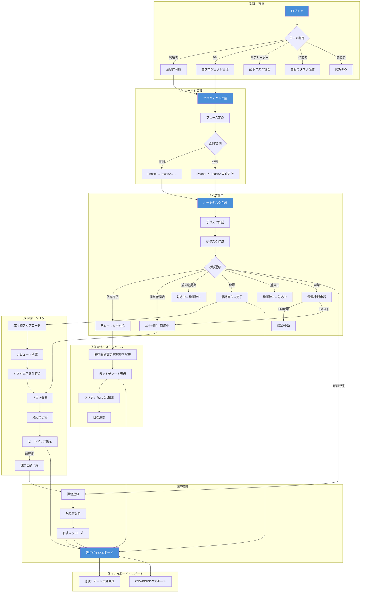

# PDM システムフロー図

```mermaid
graph TB
  subgraph "認証・権限"
    A[ログイン] --> B{ロール判定}
    B -->|管理者| C[全操作可能]
    B -->|PM| D[自プロジェクト管理]
    B -->|サブリーダー| E[配下タスク管理]
    B -->|作業者| F[自身のタスク操作]
    B -->|閲覧者| G[閲覧のみ]
  end

  subgraph "プロジェクト管理"
    C --> H[プロジェクト作成]
    D --> H
    H --> I[フェーズ定義]
    I --> J{直列/並列}
    J -->|直列| K[Phase1→Phase2→...]
    J -->|並列| L[Phase1 & Phase2 同時実行]
  end

  subgraph "タスク管理"
    K --> M[ルートタスク作成]
    L --> M
    M --> N[子タスク作成]
    N --> O[孫タスク作成]
    O --> P{状態遷移}
    P -->|依存完了| Q[未着手→着手可能]
    P -->|担当者開始| R1[着手可能→対応中]
    P -->|成果物提出| W1[対応中→承認待ち]
    P -->|承認| S1[承認待ち→完了]
    P -->|差戻し| W2[承認待ち→対応中]
    P -->|申請| RQ[保留/中断申請]
    RQ -->|PM承認| T[保留/中断]
    RQ -->|PM却下| R1
  end

  subgraph "依存関係・スケジュール"
    Q --> U[依存関係設定 FS/SS/FF/SF]
    U --> V[ガントチャート表示]
    V --> X[クリティカルパス算出]
    X --> Y[日程調整]
  end

  subgraph "成果物・リスク"
    S1 --> Z[成果物アップロード]
    Z --> Z1[レビュー→承認]
    Z1 --> Z2[タスク完了条件確認]
    R1 --> RA[リスク登録]
    Z2 --> RA
    RA --> RB[対応策設定]
    RB --> RC[ヒートマップ表示]
    RC -->|顕在化| IS[課題自動作成]
  end

  subgraph "課題管理"
    IS --> I2[課題登録]
    P -->|問題発生| I2
    I2 --> I3[対応策設定]
    I3 --> I4[解決→クローズ]
    I4 --> DB
  end

  subgraph "ダッシュボード・レポート"
    V --> DB[進捗ダッシュボード]
    S1 --> DB
    RC --> DB
    I4 --> DB
    DB --> RE[週次レポート自動生成]
    DB --> EX[CSV/PDFエクスポート]
  end

  style A fill:#4a90d9,color:#fff
  style H fill:#4a90d9,color:#fff
  style M fill:#4a90d9,color:#fff
  style DB fill:#4a90d9,color:#fff
```
